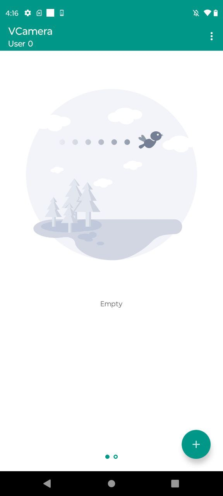

# VCamera - Updated and Restored

This repository is a **functional update and restoration** of the original [VCamera by DemonLee0719](https://github.com/DemonLee0719/VCamera), whose latest release was over 2 years ago and is currently **non-functional** in modern environments.

## 🛠 What is this?

VCamera was originally designed to act as a virtual camera on Android devices, often used alongside virtual environments like VirtualApp to run modified apps with camera capabilities.

## ✅ What's been done?

This project is based on a fork from [andvipgroup/VCamera](https://github.com/andvipgroup/VCamera), but with substantial investigation, improvements, and fixes to make it **functional again**. Key updates include:

- 🔍 **Deep investigation** into how the original VCamera was intended to work.
- 🧩 Discovery and integration of **OpenSDK**, **VirtualApp**, and internal **hooking mechanisms**.
- 🐛 Fixes for compatibility issues with modern Android systems.
- 🚀 Updated code for improved stability, compatibility, and usability.

## 💡 Goal

The purpose of this project is to serve as a stable, working base for developers and researchers interested in app virtualization and Android virtual camera injection techniques.

## 📂 Related Repositories

- Original (non-functional) repository: [DemonLee0719/VCamer](https://github.com/DemonLee0719/VCamera)
- Previous fork before this update: [andvipgroup/VCamera](https://github.com/andvipgroup/VCamera)

## 📦 Download

You can download the latest working APK from the [Releases section](https://github.com/uixss/VCamera-FIX/releases/download/apk/vCam2023.apk).

## 🧪 Current Status

✅ Functional and tested.  
⚠️ May require special permissions or a specific environment (e.g., VirtualApp, root access, etc.), depending on usage.

---

**This project is intended for educational and research purposes only. Please use it responsibly and legally.**
